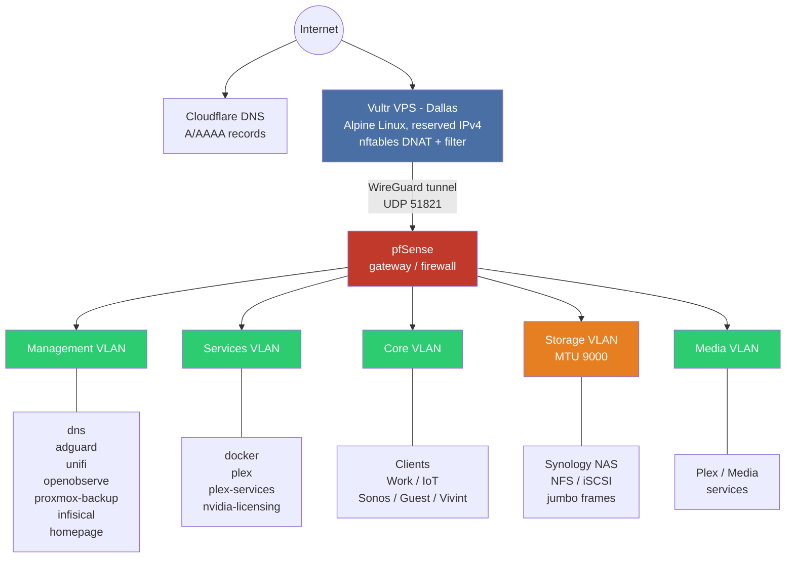
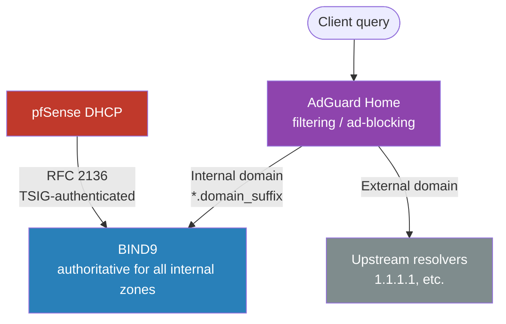
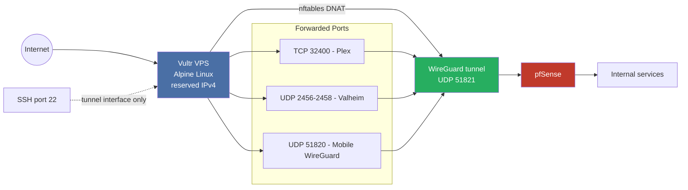
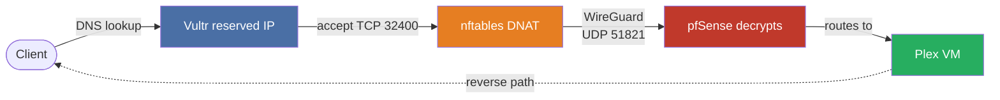
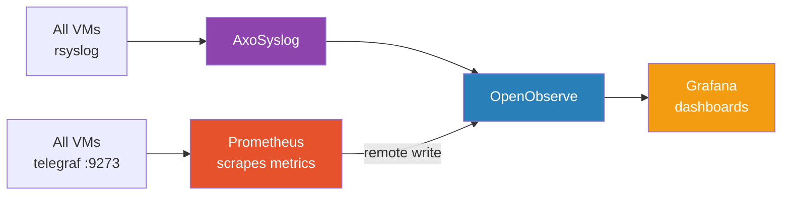

# Homelab Infrastructure-as-Code

This repository manages a Proxmox-based homelab, a Vultr VPS WireGuard relay, and network segmentation across 12 VLANs. The entire stack is automated with Terraform (infrastructure provisioning, DNS, VPS), Ansible (configuration management, 29 roles), Infisical (self-hosted secret vault with per-VM machine identities), SOPS/age (bootstrap secrets only), pre-commit hooks (security scanning), and Make (operational interface).

## Architecture



Additional VLANs not shown: infrastructure, vpn, work, iot, sonos, vivint, guest (see [VLAN table](#vlans) below).

### Key Services

- **DNS**: BIND9 (authoritative) + AdGuard Home (filtering) = split DNS
- **Monitoring**: OpenObserve + Grafana + Prometheus + 8 exporters + Uptime Kuma
- **Media**: Plex (GPU transcoding) + *arr stack + Synology NAS (NFS)
- **Containers**: Valheim, Authentik SSO, Kiwix, BOINC, Portainer, Dogecoin
- **Secrets**: Infisical (self-hosted vault) with per-VM machine identities; SOPS/age for bootstrap only (no runtime fallback)
- **Backup**: Proxmox Backup Server with nightly cron jobs
- **VPS Relay**: Encrypted WireGuard tunnel forwarding Plex, Valheim, mobile WireGuard

## Policy vs Binding Architecture

This repository separates **policy** (what the infrastructure should look like) from **bindings** (site-specific values). The repo is publishable as-is -- cloning it gives you the complete structure without any private data.

### Policy/Intent (git-tracked)

- `network-data/vlans.example.yaml` -- Schema template defining all 12 VLANs with `REPLACE` placeholders
- `network-data/public_policy.yaml` -- Abstract zone-to-zone firewall rules (no IPs)
- `ansible/group_vars/secrets.sops.example.yml` -- Secrets template with `REPLACE_ME` values
- `ansible/group_vars/bootstrap.sops.example.yml` -- Bootstrap secrets template (Infisical deployment parameters)
- All Terraform and Ansible code

### Bindings (gitignored)

- `network-data/vlans.yaml` -- Concrete VLAN IDs, subnets, bridges, DHCP ranges
- `ansible/group_vars/bootstrap.sops.yml` -- Bootstrap secrets for Infisical + Terraform (SOPS/age)
- `ansible/group_vars/secrets.sops.yml` -- SOPS fallback credentials (used when Infisical is unavailable)
- `terraform/vars.auto.tfvars` -- Terraform variable overrides

### How vlans.yaml Flows Through the Stack

`vlans.yaml` is the single source of truth for network configuration:

- **Terraform** reads it via `yamldecode(file(...))` in the network module to create SDN zones, VNETs, and assign VM interfaces
- **Ansible** loads it in playbook `pre_tasks` to compute VLAN prefix facts (`mgmt_vlan_prefix`, `services_vlan_prefix`, `storage_vlan_prefix`, `core_vlan_prefix`) used for cross-VLAN IP translation

## Network Architecture

### VLANs

All 12 VLANs defined in `network-data/vlans.example.yaml`:

| VLAN | Name | SDN Zone | MTU | Description | Managed By |
|------|------|----------|-----|-------------|------------|
| management | Management | Homelab | 1500 | SSH/Ansible access -- first NIC on every VM | pfSense, UniFi |
| storage | Storage | Storage | 9000 | NFS/iSCSI to NAS, jumbo frames | pfSense, UniFi |
| infrastructure | Infrastructure | Homelab | 1500 | Proxmox hosts | pfSense, UniFi |
| services | Services | Homelab | 1500 | DNS, monitoring, shared services | pfSense, UniFi |
| media | Media | Homelab | 1500 | Plex and media streaming services | pfSense, UniFi |
| vpn | VPN | -- | -- | WireGuard subnet on pfSense (not a switched VLAN) | pfSense |
| core | Core | Homelab | 1500 | Primary user devices, workstations | pfSense, UniFi |
| work | Work | Homelab | 1500 | Work server and work devices | pfSense, UniFi |
| iot | IoT | Homelab | 1500 | Smart home devices (client isolation) | pfSense, UniFi |
| sonos | Sonos | Homelab | 1500 | IoT without client isolation, mDNS/SSDP allowed | pfSense, UniFi |
| vivint | Vivint | Homelab | 1500 | PoE cameras | pfSense, UniFi |
| guest | Guest | Homelab | 1500 | Guest network (client isolation) | pfSense, UniFi |

**Key design decisions:**

- The **management VLAN** is always the first interface on every VM, providing SSH/Ansible access
- The **storage VLAN** uses jumbo frames (MTU 9000) for NFS/iSCSI performance
- The **VPN** entry is not a switched VLAN -- it is a pfSense-only WireGuard subnet
- Subnet derivation: `{ipv4_prefix}.{vlan_id}.0/24` (computed by consumers)
- DHCP, DNS zones, and domain prefixes are defined per-VLAN

### Proxmox SDN

Two SDN zones map physical bridges to VLAN groups:

| SDN Zone | Bridge | MTU | Purpose |
|----------|--------|-----|---------|
| Homelab | vmbr1 | 1500 | All general-purpose VLANs |
| Storage | vmbr2 | 9000 | Storage VLAN with jumbo frames |

VNETs use the VNET name as the bridge identifier (e.g., "Mgmt", "Core", "Services"). `vlan_id` is **not** set on SDN VNETs -- it is only set on physical bridges (`vmbr*`). SDN is managed by `terraform/modules/network/sdn.tf` via the `manage_sdn` flag.

### Firewall Policy

Zone-to-zone rules from `network-data/public_policy.yaml`:

| From | To | Service | Action | Notes |
|------|----|---------|--------|-------|
| management | infrastructure, services, media | SSH (TCP 22) | Allow | Administrative access |
| core, work, iot, sonos, guest, vivint | infrastructure | DNS (UDP+TCP 53) | Allow | All zones can resolve DNS |
| iot | infrastructure | NTP (UDP 123) | Allow | Time sync for IoT devices |
| work | sonos | mDNS (UDP 5353) | Allow | AirPlay/service discovery |
| work | media | AirPlay (TCP 7000,7100,5000,5001) | Allow | AirPlay control channels |
| services, media | infrastructure | PBS API (TCP 8007) | Allow | Backup clients to PBS |
| services, media | storage | NFS (TCP 2049) | Allow | NFS access to Synology NAS |
| iot, guest, vivint, sonos | management | Any | **Deny** | Untrusted zones blocked from management |

### DNS Architecture

Split DNS with filtering and dynamic registration:



BIND9 serves authoritative records for each VLAN's domain prefix (e.g., `mgmt.{domain_suffix}`, `services.{domain_suffix}`). pfSense pushes DHCP leases to BIND9 via RFC 2136 dynamic DNS updates using a TSIG key.

See [docs/split-dns-adguard.md](docs/split-dns-adguard.md) for full setup details.

## VPS WireGuard Relay

The Vultr VPS in Dallas acts as a dumb encrypted relay -- it makes no routing decisions and runs no DNS. All forwarded traffic passes through a WireGuard tunnel to pfSense at home.

### Architecture



### Key Details

- **pfSense initiates** the WireGuard handshake (VPS has no `Endpoint` configured in its peer section)
- **Reserved IPv4** survives instance rebuilds; IPv6 changes on rebuild (AAAA records auto-update via Terraform)
- **Dual-stack**: IPv4 primary, IPv6 ULA on tunnel
- **nftables architecture**: `table inet filter` (dual-stack input/forward), `table ip nat` + `table ip6 nat` (separate DNAT per address family)
- **Rate limiting**: Plex connections rate-limited (10 new connections/min per source by default)
- **GeoIP filtering**: Optional MaxMind GeoLite2 integration
- **Hardening**: fail2ban, AIDE file integrity monitoring, sysctl hardening, LBU (Alpine local backup)
- **Three-phase deployment**: `make vps-deploy` opens SSH in Vultr firewall, runs Ansible, then closes SSH

### Traffic Flow (Plex Example)



See also:
- [docs/pfsense-wireguard-vps-peer.md](docs/pfsense-wireguard-vps-peer.md) -- VPS tunnel peer setup on pfSense
- [docs/pfsense-wireguard-mobile-peers.md](docs/pfsense-wireguard-mobile-peers.md) -- Mobile WireGuard client configuration
- [docs/key-rotation-procedure.md](docs/key-rotation-procedure.md) -- WireGuard key rotation procedure

## Virtual Machines

All VMs are defined in `terraform/vm-configs.tf` and provisioned with cloud-init (no Packer for Linux):

| VM | VMID | VLANs | CPU | RAM | Disk | GPU | Purpose |
|----|------|-------|-----|-----|------|-----|---------|
| unifi | 100 | mgmt | 4 | 4 GB | 50 GB | -- | UniFi Controller |
| proxmox-backup | 101 | mgmt, services, storage | 4 | 8 GB | 20 GB | -- | Proxmox Backup Server |
| adguard | 102 | mgmt, services | 4 | 2 GB | 20 GB | -- | AdGuard Home (DNS filtering) |
| openobserve | 103 | mgmt, services | 4 | 16 GB | 50 GB | -- | Monitoring stack (OpenObserve, Grafana, Prometheus) |
| docker | 104 | mgmt, services, storage | 16 | 64 GB | 100 GB | NVIDIA | Container workloads (Valheim, Authentik, etc.) |
| infisical | 105 | mgmt, services | 4 | 4 GB | 30 GB | -- | Self-hosted secret vault |
| plex-services | 106 | mgmt, services, storage | 4 | 8 GB | 256 GB | -- | *arr stack, PostgreSQL, Jellyseerr |
| nvidia-licensing | 107 | mgmt, services | 2 | 2 GB | 20 GB | -- | NVIDIA GRID license server (FastAPI DLS) |
| plex | 108 | mgmt, services, storage | 8 | 32 GB | 100 GB | NVIDIA | Plex Media Server (hardware transcoding) |
| dns | 109 | mgmt, services | 4 | 2 GB | 20 GB | -- | BIND9 authoritative DNS |

**IP addressing:**

- `vm_id` determines the static management IP: VMID 109 maps to `{prefix}.{mgmt_vlan_id}.109`
- `ip_offset` determines the static IP on service/storage VLANs
- Management VLAN is always the first NIC
- GPU passthrough is configured for `plex` and `docker` VMs (NVIDIA GRID drivers)

## Services

### Monitoring Stack (openobserve VM)

Docker Compose services on the openobserve VM:

| Container | Port | Purpose |
|-----------|------|---------|
| OpenObserve | 5080 | Log + metric aggregation |
| Grafana | 3000 | Dashboards and visualization |
| Prometheus | 9090 | Metric scraping and remote write to OpenObserve |
| Blackbox Exporter | 9115 | DNS/HTTP/ICMP/TLS probes |
| Node Exporter | 9100 | Host metrics |
| Proxmox VE Exporter | 9221 | Hypervisor metrics |
| Speedtest Exporter | 9798 | Internet speed tests |
| SNMP Exporter | 9116 | Synology NAS metrics |
| UniFi Poller | 9130 | Network infrastructure metrics |
| PBS Exporter | 10019 | Backup server metrics |
| AxoSyslog | 5514/6514 | Syslog receiver (UDP+TCP+TLS) |
| Uptime Kuma | 3001 | Status page and uptime monitoring |



Prometheus also monitors DNS resolution across VLAN zones, HTTP endpoints, ICMP reachability, TLS certificates, Synology NAS via SNMP, Proxmox hypervisor, and PBS backup status.

### Plex Media Server (plex VM)

- NFS mount from Synology NAS (storage VLAN, jumbo frames)
- NVIDIA GPU for hardware transcoding
- Let's Encrypt TLS certificate via DNS-01 (Cloudflare)
  - certbot with cloudflare plugin, auto-renewal via systemd timer
  - PEM to PKCS#12 conversion, deployed to Plex Preferences.xml
- PBS backup (nightly at 2 AM via cron)
- External access via VPS WireGuard relay (see [docs/pfsense-wireguard-vps-peer.md](docs/pfsense-wireguard-vps-peer.md))

### Media Automation (plex-services VM)

Docker Compose services managing the *arr stack:

| Container | Purpose |
|-----------|---------|
| Sonarr | TV series management |
| Radarr | Movie management |
| Prowlarr | Indexer management |
| Bazarr | Subtitle management |
| Lidarr | Music management |
| Readarr | Ebook management |
| SABnzbd | Usenet downloader |
| Tautulli | Plex usage statistics |
| Jellyseerr | Media request management |
| Recyclarr | *arr quality profile sync |
| Cloudflared | Cloudflare Tunnel |
| PostgreSQL 17 | Shared database for *arr services |
| Portainer | Container management UI |

NFS mount from Synology for media data. PBS backup (nightly, separate namespace for databases).

### Docker VM Services

Active containers on the docker VM:

| Container | Ports | Purpose |
|-----------|-------|---------|
| Valheim | UDP 2456-2458 | Dedicated game server (forwarded via VPS) |
| Authentik | -- | SSO/OIDC identity provider (separate Compose stack) |
| Kiwix | 8090 | Offline Wikipedia |
| BOINC | 7080-7081 | Distributed computing (GPU-accelerated) |
| Portainer | 9000 | Container management UI |
| Dogecoin | 22555 | Dogecoin full node |

### Infisical Secret Vault (infisical VM)

Self-hosted secret management platform deployed via Docker Compose:

- **Stack**: Infisical server (port 8080) + PostgreSQL 16 + Redis 7
- **Machine identities**: Each service VM gets a unique identity (`{hostname}-vm`) with Universal Auth credentials stored in `/etc/infisical/`
- **Infisical Agent**: Runs as a systemd service on each VM, authenticating with its machine identity and rendering secrets to environment files via Go templates
- **Polling interval**: 60 seconds -- secret updates propagate within one minute
- **No SOPS fallback**: If Infisical is unreachable, the deploy fails with a clear error. `secrets.sops.yml` is a DR artifact only (produced by `make infisical-backup`)
- **Protected**: Terraform `protected = true` prevents accidental deletion

### Other Services

- **UniFi Controller** (unifi VM) -- Network management for UniFi switches and APs
- **Proxmox Backup Server** (proxmox-backup VM) -- VM backup with deduplication
- **NVIDIA Licensing Server** (nvidia-licensing VM) -- FastAPI DLS for GRID vGPU drivers

## Ansible Roles

29 roles in a single flat directory (`ansible/roles/`):

### Infrastructure

| Role | Description |
|------|-------------|
| bind9 | BIND9 authoritative DNS server with dynamic zone generation |
| adguard | AdGuard Home DNS filtering and ad-blocking |
| dns_config | Per-VM DNS resolver configuration (resolv.conf) |
| monitoring | Full monitoring stack (OpenObserve, Grafana, Prometheus, exporters) |
| openobserve_dashboards | Grafana dashboard provisioning |
| monitoring_users | Service account provisioning for monitoring |
| proxmox_backup | Proxmox Backup Server configuration |
| unifi | UniFi Controller deployment |
| infisical | Self-hosted Infisical secret vault deployment |
| pfsense | pfSense DHCP scopes and RFC 2136 DNS registration |

### Services

| Role | Description |
|------|-------------|
| plex | Plex Media Server installation, NFS mounts, PBS backup |
| plex_certificate | Let's Encrypt TLS via DNS-01 (Cloudflare), PKCS#12 conversion |
| plex_services | *arr stack Docker Compose deployment with PostgreSQL |
| docker | Docker daemon, NVIDIA container toolkit, container workloads |
| authentik | Authentik SSO/OIDC identity provider (Docker Compose) |
| nvidia | NVIDIA GRID vGPU driver installation |
| nvidia_licensing | FastAPI DLS license server |
| homepage | Homepage dashboard with Caddy reverse proxy |
| lancache | LAN game cache server |

### VPS

| Role | Description |
|------|-------------|
| vps_wireguard | WireGuard tunnel configuration (dual-stack) |
| vps_nftables | nftables firewall with DNAT forwarding rules |
| vps_hardening | SSH hardening, fail2ban, AIDE, sysctl, LBU |

### Cross-cutting

| Role | Description |
|------|-------------|
| hardening | UFW firewall configuration for internal VMs |
| infisical_client | Infisical agent, machine identity provisioning, secret templating |
| pbs_client | Proxmox Backup Server client and scheduled backup |
| rsyslog_client | Rsyslog forwarding to AxoSyslog/OpenObserve |
| telegraf | Telegraf metrics agent (Prometheus output) |
| expand_disk | Root filesystem expansion after disk resize |
| portainer_agent | Portainer agent for remote container management |

### External (Ansible Galaxy)

| Role | Description |
|------|-------------|
| geerlingguy.docker | Docker CE installation |
| juju4.openobserve | OpenObserve base installation |
| infisical.vault | Infisical login and secret reading modules |
| mitre.yedit | YAML/XML editing utilities |

## Playbooks

| Playbook | Targets | Purpose |
|----------|---------|---------|
| site.yml | All | Full deployment (imports infrastructure + services) |
| bootstrap.yml | AdGuard + Infisical | First-time deployment -- AdGuard DNS + Infisical vault + secret seeding |
| infrastructure.yml | DNS, AdGuard, OpenObserve, PBS | Phase 1: core services, Phase 2: monitoring clients |
| services.yml | All service VMs | Media, Docker, Plex, NVIDIA licensing |
| pfsense.yml | pfSense | DHCP scopes + RFC 2136 DNS registration |
| vps.yml | VPS | WireGuard, nftables, hardening, monitoring agents |
| docker.yml | Docker VM | Docker daemon + Authentik |
| unifi.yml | UniFi VM | UniFi Controller deployment |
| docker-config.yml | Service VMs | Lightweight compose+config deploy (no full role) |
| update-all.yml | All + VPS | OS patching (apt/apk) |
| update-dns.yml | DNS VMs | DNS configuration updates |
| backup-clients.yml | Multiple | PBS client configuration |
| vps-rotate-keys.yml | VPS | WireGuard key rotation |
| refresh-identity.yml | Service VMs | Refresh Infisical machine identity credentials |
| expand-disk.yml | Service VMs | Root filesystem expansion |

## Secrets Management

Secrets use a two-tier architecture: Infisical as the primary runtime vault and SOPS/age as a bootstrap fallback.

### Tier 1: Bootstrap (SOPS)

`bootstrap.sops.yml` is encrypted with [SOPS](https://github.com/getsops/sops) using [age](https://github.com/FiloSottile/age) keys (configured in `.sops.yaml`). It contains only the minimum secrets needed before Infisical exists:

- Terraform provider credentials (Proxmox, Vultr, Cloudflare)
- Infisical deployment parameters (PostgreSQL password, encryption key, auth secret)
- Infisical admin machine identity credentials (written back by `make bootstrap`)

Decrypted at playbook runtime by the `community.sops` Ansible plugin.

### Tier 2: Runtime (Infisical)

All operational secrets are stored in the self-hosted Infisical vault. Each VM gets a unique machine identity with Universal Auth credentials.

Secrets are organized into per-VM paths:

| Path | Consumers | Examples |
|------|-----------|---------|
| `/shared` | All service VMs | PBS backup token, PBS fingerprint |
| `/monitoring` | openobserve | OpenObserve root password, Grafana admin, Proxmox/UniFi/PBS monitoring tokens |
| `/plex` | plex | Plex token, TLS certificate password, SMB credentials, Cloudflare token |
| `/plex-services` | plex-services | PostgreSQL password, Cloudflared tunnel token, Valheim password |
| `/docker` | docker | Cloudflared tunnel token |
| `/infrastructure` | dns, proxmox-backup | BIND TSIG key, PBS admin password, UniFi credentials |
| `/vps` | VPS (via Ansible) | WireGuard keys, tunnel addresses |
| `/pfsense` | pfSense (via Ansible) | WireGuard keys, DHCP/DNS configuration |

The Infisical Agent runs on each service VM as a systemd service, rendering secrets to environment files via Go templates with a 60-second polling interval.

### No Fallback

If Infisical is unreachable, Ansible **fails with a clear error**. There is no SOPS fallback at runtime. `secrets.sops.yml` is a disaster recovery artifact only, produced by `make infisical-backup`.

**Secret categories:**

| Category | Tier | Examples |
|----------|------|---------|
| Terraform credentials | Bootstrap | Proxmox API tokens, Vultr API key, Cloudflare token |
| Infisical deployment | Bootstrap | PostgreSQL password, encryption key, auth secret |
| Infrastructure auth | Runtime | UniFi credentials, Synology password |
| WireGuard tunnel | Runtime | Private keys, tunnel addresses, peer allowed IPs |
| Monitoring | Runtime | OpenObserve root password, Grafana admin password |
| Backup | Runtime | PBS admin password, backup tokens, monitoring tokens |
| Service passwords | Runtime | PostgreSQL, Plex SMB, Valheim server password |
| API tokens | Runtime | Cloudflare DNS token, Cloudflared tunnel token |
| SSO | Runtime | Authentik secret key, Authentik PostgreSQL password |
| TLS | Runtime | Plex PKCS#12 certificate password |
| DNS | Runtime | BIND9 TSIG key for RFC 2136 dynamic updates |
| GeoIP | Runtime | MaxMind license key (optional) |

## Getting Started

1. **Clone the repo**

   ```bash
   git clone <repo-url> && cd homelab
   ```

2. **Initialize dependencies**

   ```bash
   make init
   ```

   Creates a Python venv, installs pip dependencies, initializes Terraform, and pulls Ansible Galaxy roles.

3. **Bootstrap local config**

   ```bash
   make bootstrap-local
   ```

   Copies example files to their local (gitignored) counterparts:
   - `network-data/vlans.example.yaml` -> `network-data/vlans.yaml`
   - `ansible/group_vars/bootstrap.sops.example.yml` -> `ansible/group_vars/bootstrap.sops.yml`
   - `ansible/group_vars/secrets.sops.example.yml` -> `ansible/group_vars/secrets.sops.yml`
   - Terraform variable files

4. **Fill in site-specific values** in the gitignored files:
   - `network-data/vlans.yaml` -- VLAN IDs, subnets, bridges, DHCP ranges
   - `ansible/group_vars/bootstrap.sops.yml` -- Terraform credentials, Infisical deployment parameters
   - `ansible/group_vars/secrets.sops.yml` -- All operational credentials and keys
   - `terraform/vars.auto.tfvars` -- Provider credentials, region preferences

5. **Encrypt bootstrap secrets**

   ```bash
   sops --encrypt --in-place ansible/group_vars/bootstrap.sops.yml
   ```

6. **Bootstrap Infisical + AdGuard**

   ```bash
   make bootstrap
   ```

   Deploys AdGuard (DNS) and Infisical VMs, configures the vault, creates the admin account and machine identity, and seeds secrets from SOPS into Infisical.

7. **Deploy VPS relay**

   ```bash
   make vps-deploy
   ```

8. **Review Terraform plan**

   ```bash
   make plan
   ```

9. **Full deployment**

   ```bash
   make apply
   ```

   Runs Terraform apply, generates Ansible inventory from Terraform outputs, then runs the full Ansible site playbook. Each service VM receives an Infisical machine identity and agent.

10. **Install pre-commit hooks**

    ```bash
    make setup-hooks
    ```

## Makefile Reference

The Makefile is the primary operational interface.

### Core Operations

| Target | Description |
|--------|-------------|
| `apply` | Full deployment: Terraform apply, inventory generation, Ansible site playbook |
| `plan` | Terraform init + plan (review changes before applying) |
| `init` | Create Python venv, install deps, init Terraform, pull Galaxy roles |
| `bootstrap` | First-time deployment: AdGuard + Infisical VMs + secret seeding |
| `terraform-bootstrap` | Terraform apply for bootstrap VMs only |
| `terraform-apply` | Terraform init + apply (auto-approve) |
| `inventory` | Generate Ansible inventory from Terraform outputs |

### Targeted Operations

| Target | Description |
|--------|-------------|
| `ansible <vm>` | Run site.yml limited to a single host (supports `TAGS=`) |
| `docker-config <vm>` | Deploy only compose+config templates and restart (no full role) |

### Ansible Playbooks

All `ansible-*` targets support `TAGS=<tag>` to filter by play-level tags (e.g., `make ansible-services TAGS=plex`).

| Target | Description |
|--------|-------------|
| `ansible-all` | Run full site playbook (infrastructure + services) |
| `ansible-infra` | Run infrastructure playbook only |
| `ansible-services` | Run services playbook only |
| `ansible-pfsense` | Run pfSense playbook (DHCP + DNS registration) |
| `docker-deploy` | Run docker playbook only |
| `update` | OS patching on all VMs + VPS |
| `update-dns` | Update DNS configuration |
| `expand-disk` | Expand root filesystem on service VMs |

### Secrets

| Target | Description |
|--------|-------------|
| `infisical-seed` | Migrate secrets from SOPS to Infisical |
| `infisical-backup` | Export Infisical secrets to SOPS format |
| `infisical-organize` | Organize flat secrets into per-VM folders |
| `refresh-identity` | Refresh Infisical machine identity credentials |
| `plex-token` | Retrieve Plex authentication token |

### VPS Management

| Target | Description |
|--------|-------------|
| `vps-deploy` | Three-phase: open SSH, Ansible configure, close SSH |
| `vps-destroy` | Destroy VPS instance (keeps reserved IP) |
| `vps-rebuild` | Destroy + redeploy VPS from scratch |
| `vps-rotate-keys` | Rotate WireGuard keys on VPS |

### Setup and Security

| Target | Description |
|--------|-------------|
| `setup-hooks` | Install pre-commit hooks |
| `bootstrap-local` | Copy example files to local gitignored config |
| `validate-public-policy` | Validate public_policy.yaml schema |
| `security-check` | Run security guardrails on staged files |
| `security-check-range` | Run security guardrails on a commit range |

### Cleanup

| Target | Description |
|--------|-------------|
| `clean` | Destroy all Terraform resources + clean SSH known_hosts |
| `clean-ssh` | Remove all inventory IPs from SSH known_hosts |
| `clean-infisical-sops` | Reset Infisical fields in SOPS files |

## Security

### Pre-commit Hooks

Configured in `.pre-commit-config.yaml`:

- **check-merge-conflict** -- Prevents committing merge conflict markers
- **detect-private-key** -- Scans for accidentally committed private keys
- **trailing-whitespace** -- Enforces clean whitespace
- **end-of-file-fixer** -- Ensures files end with a newline
- **homelab-security-guardrails** -- Custom hook that blocks commits to protected paths (`all.yml`, `terraform.tfstate`, `vms.yaml`) and validates policy schema

### Defense in Depth

- **Infisical**: Per-VM machine identities with least-privilege RBAC, path-scoped secret access, automatic secret rotation via agent polling
- **SOPS encryption** for bootstrap secrets (age keys, no GPG)
- **SSH hardened**: key-only auth, tunnel-only listen address on VPS, fail2ban, MaxAuthTries 3
- **nftables default-deny** on VPS (only explicitly allowed ports pass)
- **UFW** on all internal VMs (hardening role)
- **Network segmentation**: 12 VLANs with zone-to-zone firewall policy
- **AIDE** file integrity monitoring on VPS
- **No secrets in git**: `.gitignore` covers all binding files (vlans.yaml, secrets.sops.yml, tfstate, tfvars)
- **Three-phase VPS deployment**: SSH only open during provisioning, then closed in Vultr firewall

## Directory Structure

```
homelab/
├── Makefile                        # Primary operational interface
├── .pre-commit-config.yaml         # Git hooks (security scanning)
├── .sops.yaml                      # SOPS encryption config (age)
├── terraform/
│   ├── main.tf, provider.tf        # Provider configuration
│   ├── variables.tf, outputs.tf    # Variables and inventory output
│   ├── vm-configs.tf               # All 10 VM definitions
│   ├── vultr-vps.tf                # VPS instance, firewall, bootstrap
│   ├── cloudflare-dns.tf           # DNS A/AAAA records
│   ├── pci.tf                      # GPU passthrough configuration
│   └── modules/
│       ├── network/                # Reads vlans.yaml, manages SDN zones/VNETs
│       └── proxmox-vm/            # VM provisioning with cloud-init
├── ansible/
│   ├── ansible.cfg                 # Ansible configuration
│   ├── requirements.yml            # Galaxy role dependencies
│   ├── group_vars/                 # all.yml, secrets.sops.yml
│   ├── inventory/                  # vms.yaml (generated), static: pfsense, proxmox, vps
│   ├── playbooks/                  # 15 playbooks
│   └── roles/                      # 29 roles (flat directory)
├── network-data/
│   ├── vlans.example.yaml          # Schema template (tracked)
│   ├── vlans.yaml                  # Site-specific bindings (gitignored)
│   └── public_policy.yaml          # Zone-to-zone firewall intent (tracked)
├── scripts/
│   ├── bootstrap_local_config.sh   # Copy example files to local config
│   ├── seed_infisical.sh           # SOPS to Infisical secret migration
│   ├── infisical_to_sops.py        # Infisical to SOPS backup export
│   ├── organize_infisical_folders.sh  # Organize secrets into per-VM folders
│   ├── security_guardrails.sh      # Pre-commit security checks
│   └── validate_public_policy.py   # Policy YAML schema validator
├── docs/                           # Operational runbooks
└── archive/                        # Deprecated configs (Packer, old projects)
```

## Further Reading

| Document | Description |
|----------|-------------|
| [docs/pfsense-wireguard-vps-peer.md](docs/pfsense-wireguard-vps-peer.md) | VPS tunnel peer setup on pfSense |
| [docs/pfsense-wireguard-mobile-peers.md](docs/pfsense-wireguard-mobile-peers.md) | Mobile WireGuard client configuration |
| [docs/pfsense-firewall-rules.md](docs/pfsense-firewall-rules.md) | pfSense firewall rules reference |
| [docs/split-dns-adguard.md](docs/split-dns-adguard.md) | AdGuard + BIND9 split DNS setup |
| [docs/authentik-setup.md](docs/authentik-setup.md) | Authentik SSO/OIDC configuration |
| [docs/cloudflare-tunnel-setup.md](docs/cloudflare-tunnel-setup.md) | Cloudflare Tunnel integration |
| [docs/key-rotation-procedure.md](docs/key-rotation-procedure.md) | WireGuard key rotation procedure |
| [docs/uptime-kuma-monitors.md](docs/uptime-kuma-monitors.md) | Uptime Kuma monitor configuration |
| [docs/uptimerobot-setup.md](docs/uptimerobot-setup.md) | UptimeRobot external monitoring |
| [docs/bandwidth-planning.md](docs/bandwidth-planning.md) | Network bandwidth planning |
